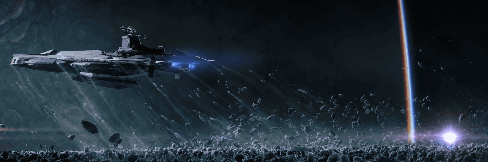

  

<h1 align="center">Alexander Taylor · Lordkoii</h1>

  <strong>Independent Developer · Reliability & Automation Engineer · Builder of Cosmic Utilities</strong>

  Building practical software, overlays, utility tools, and reliability systems with a focus on usability, observability, automation, and real-world problem solving.

  
  

## What I'm Building

I build software around two themes: **useful tools for real users** and **systems that are easier to understand, test, and trust**.

### Cosmic Utilities

**Cosmic Utilities** is an expanding family of independently developed tools and experiences with a shared space-inspired design language and an emphasis on reliability, usability, and thoughtful engineering.

| Project | Description |
| --- | --- |
| [**Cosmic Pulse**](https://github.com/Lordkoii/Cosmic-Pulse) | Star Citizen performance intelligence for Windows—telemetry, bottleneck analysis, optimization validation, and reliability diagnostics. |
| [**Cosmic Relay**](https://github.com/Lordkoii/Cosmic-Relay) | A lightweight, customizable media overlay designed to keep currently playing media visible without breaking immersion. |

Both are free community tools. Support helps cover code signing, testing, release infrastructure, and continued development.

### Orbital Reliability Lab

[**Orbital Reliability Lab**](https://github.com/Lordkoii/Orbital-Reliability-Lab) is an independent systems reliability, automation, validation, and operations engineering lab for simulated high-consequence environments.

It currently explores two operational domains on a shared reliability core:

- **Mission Operations** — telemetry, ground systems, redundancy, failover, and mission-readiness concepts
- **Factory Operations** — equipment state, production flow, MES-style tracking, fault isolation, recovery, and validation

Core response contract:

`INJECT → DETECT → DIAGNOSE → ISOLATE → RECOVER → VALIDATE → EVIDENCE`

ORL is an independent portfolio project and is not affiliated with SpaceX, Tesla, Starlink, Terafab, or their subsidiaries.

## Engineering Background

I work across technical support, quality engineering, reliability, and operations—diagnosing complex problems, improving system behavior, validating changes, and turning recurring pain points into useful software.

- Production troubleshooting across applications, APIs, databases, and cloud infrastructure
- Reproduction, validation, root-cause analysis, incident response, and operational readiness
- Browser and API automation with Playwright and Postman
- Cloud, container, database, and observability tooling

## Technical Toolkit

**Cloud & Infrastructure:** AWS, GCP, Kubernetes, Docker, Terraform  
**Data:** PostgreSQL, MySQL, Snowflake, OpenSearch, SQL  
**Quality & APIs:** Playwright, Postman, REST APIs, test planning, reproduction, and validation  
**Reliability & Operations:** Incident response, root-cause analysis, production support, monitoring, release validation, and operational readiness

## Current Focus

- Expanding the **Cosmic Utilities** ecosystem
- Evolving **Orbital Reliability Lab** across mission and advanced-manufacturing reliability concepts
- Deepening automation, observability, distributed-systems, and validation experience
- Building useful software in public and documenting the engineering decisions behind it

## Connect

- [LinkedIn](https://www.linkedin.com/in/lordkoii/) — professional background and career history
- [Ko-fi](https://ko-fi.com/cosmicutilities) — Cosmic Utilities project hub and support
- GitHub — source, releases, experiments, and engineering work
